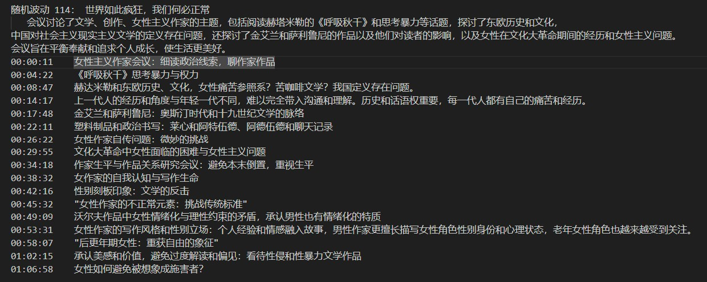

# 妙记


[中文](README.md) | [English](README.en.md)


妙记是一个围绕长音频文件的智能助手。它使用目前开源效果最好的中文语音识别模型 paraformer，先将播客转换为文字稿，然后利用大语言模型对文字稿进行总结，依据时点获得播客的精华摘要，还可以开展问答，续写。


## 主要功能

- 将播客转换为文字稿
- 使用大语言模型对文字稿进行总结，生成精华摘要 （目前支持 openai 和 chatglm, openbuddy等开源中文模型）
- （TODO）增加聊天功能，让用户可以基于播客内容进行问答
- （TODO）基于多个长音频，建立向量数据库，支持续写

## 特点
- 中文识别效果精准，强于 openai 的 whisper large 模型
- 支持完全私有化部署，[随机播客E114识别结果](media/out.txt)



## 安装和使用

```bash
# 下载模型
bash downloads/download.sh
# 安装依赖
pip3 install -r requirements.txt
# 开始运行
python3 pipeline.py --wav dowloads/test_audios/e114.mp3
```
